---

## How apps run on VMs

The cleanest approach for your platform is **Python processes launched via SSH**, not Docker (yet). Here's why and how:First, the key insight — your platform deploys **artifact-wise, not service-wise**. 




Let me show you exactly what that means:




Now let me show the three deployment modes your platform should support:Now the most important 
part — what `main.py` actually needs to do to support all this:

---

## How the runtime actually works

### `main.py` is a multi-mode launcher

It doesn't just run the agent — it reads `--role` and `--artifact` args and boots the right thing as a FastAPI server:

```python
# main.py  (platform-generated runtime wrapper)
import argparse, uvicorn
from fastapi import FastAPI
from agents.email_classifier_agent import EmailClassifierAgent
from tools.text_simplifier import TextSimplifierTool
from tools.email_categorizer import EmailCategorizerTool
from tools.priority_scorer import PriorityScorerTool
from orchestrators.email_pipeline import EmailPipelineOrchestrator

app = FastAPI()

def boot_agent(port):
    agent = EmailClassifierAgent()
    agent.initialize()

    @app.post("/run")
    def run(body: dict):
        result = agent.run(user_input=body["email"])
        return result.to_dict()

    @app.get("/health")
    def health():
        return agent.health()

    uvicorn.run(app, host="0.0.0.0", port=port)

def boot_tool(artifact_id, port):
    tools = {
        "text-simplifier":   TextSimplifierTool,
        "email-categorizer": EmailCategorizerTool,
        "priority-scorer":   PriorityScorerTool,
    }
    tool = tools[artifact_id]()
    tool.initialize()

    @app.post("/run")
    def run(body: dict):
        return tool.run(**body).data

    @app.get("/health")
    def health():
        return tool.health()

    uvicorn.run(app, host="0.0.0.0", port=port)

if __name__ == "__main__":
    parser = argparse.ArgumentParser()
    parser.add_argument("--role",     required=True)   # agent | tool | orchestrator | model
    parser.add_argument("--artifact", default=None)    # artifact id for tool/model
    parser.add_argument("--port",     type=int, default=8000)
    parser.add_argument("--email",    default=None)    # CLI mode: path to email file
    args = parser.parse_args()

    if args.email:
        # Pure CLI mode — no server, just run and print
        agent = EmailClassifierAgent()
        agent.initialize()
        result = agent.classify(open(args.email).read())
        print(result.summary())

    elif args.role == "agent":
        boot_agent(args.port)
    elif args.role == "tool":
        boot_tool(args.artifact, args.port)
    # ... etc
```

### What the deployer does over SSH

```
# Step 1 — copy app to VM
scp email-classifier-agent.zip ubuntu@192.168.1.10:/opt/aether/apps/

# Step 2 — on the VM, unpack and install
ssh ubuntu@192.168.1.10 "
  cd /opt/aether/apps
  unzip email-classifier-agent.zip -d email_classifier/
  cd email_classifier
  python3.11 -m venv .venv
  .venv/bin/pip install -r requirements.txt
"

# Step 3 — write a systemd unit per process and start it
# For agent:
ssh ubuntu@192.168.1.10 "
  cat > /etc/systemd/system/aether-email-agent.service << EOF
[Unit]
After=network.target

[Service]
WorkingDirectory=/opt/aether/apps/email_classifier
ExecStart=/opt/aether/apps/email_classifier/.venv/bin/python main.py --role agent --port 8001
Restart=on-failure
Environment=ANTHROPIC_API_KEY=sk-ant-...

[Install]
WantedBy=multi-user.target
EOF
  systemctl daemon-reload
  systemctl enable aether-email-agent
  systemctl start aether-email-agent
"

# For each tool, same pattern with --role tool --artifact text-simplifier --port 8101
```

---

## Answering your specific question: distributed by artifact or by service?

**By artifact type.** In your platform:

- 1 agent = 1 process = 1 systemd service on VM-1
- 1 orchestrator = 1 process = 1 systemd service (can share VM-1)
- Each tool = 1 process = 1 systemd service on VM-2 (so 3 tools = 3 processes)
- Model server = 1 process = 1 systemd service on VM-3 (optional — if using external API like Anthropic, this just proxies; if local LLM weights, this hosts them)

So your email classifier with 3 tools ends up as **6 processes total** across VMs. They all communicate over plain HTTP. The orchestrator calls `POST http://192.168.1.11:8101/run` instead of calling the tool in-process.

The developer controls all of this through the `distribution.nodes` block in `config.yaml`. Your platform reads it, maps each node to an available VM, and deploys accordingly. Docker comes later — start with Python processes + systemd, it's far simpler to debug and perfectly scalable for your use case.


Right now, main.py is hardcoded — it manually imports every artifact class by name. That's fine for one app, but your platform needs to deploy any app a developer uploads. You can't know in advance what classes they'll have.
So the deployer needs to generate main.py at deploy time by reading config.yaml.
